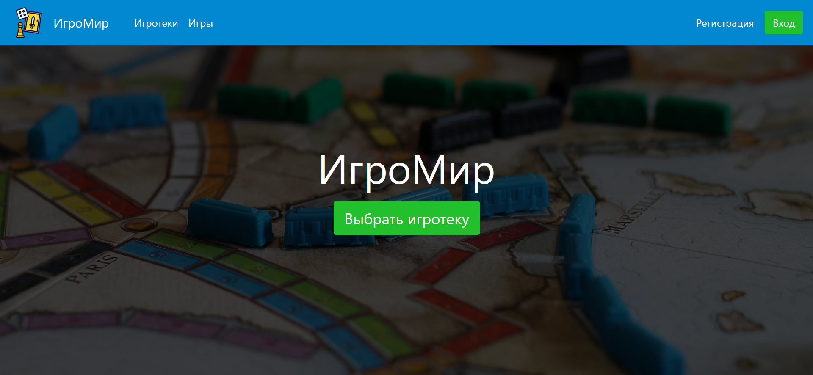
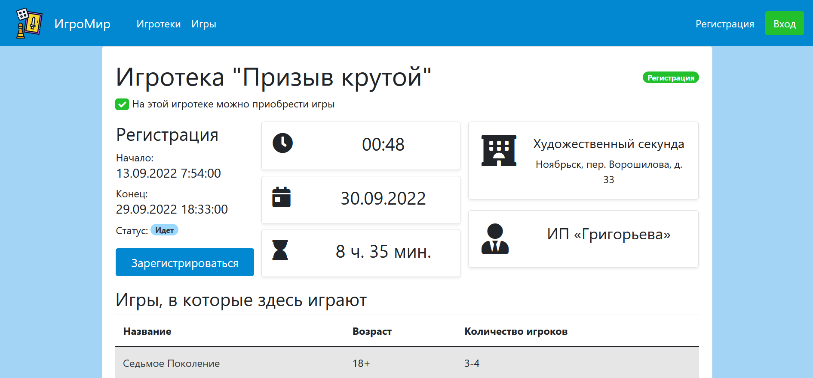
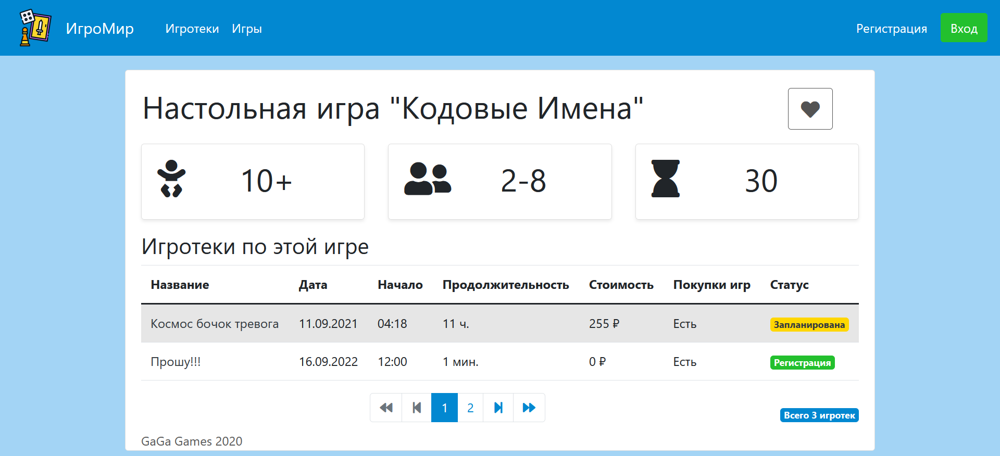
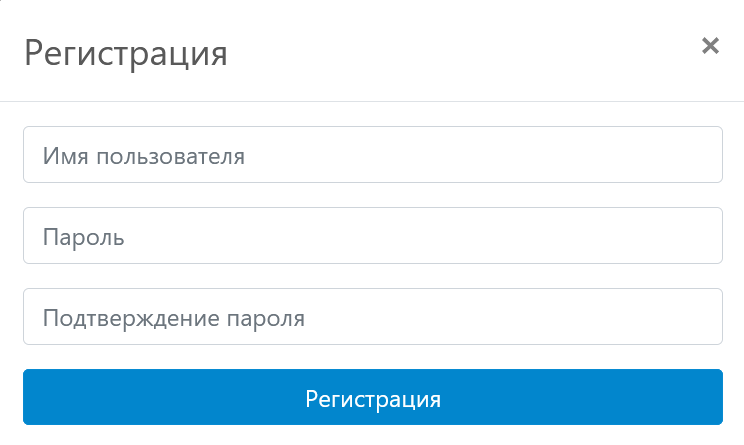
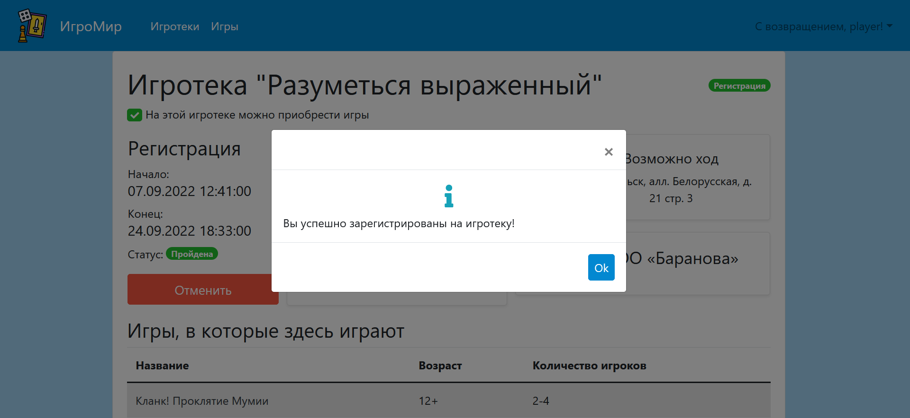
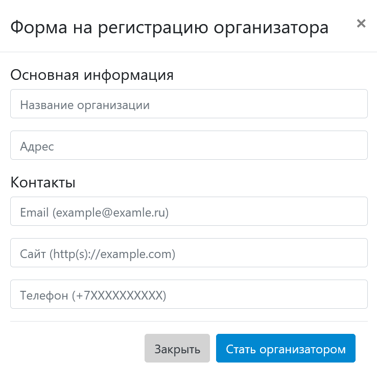
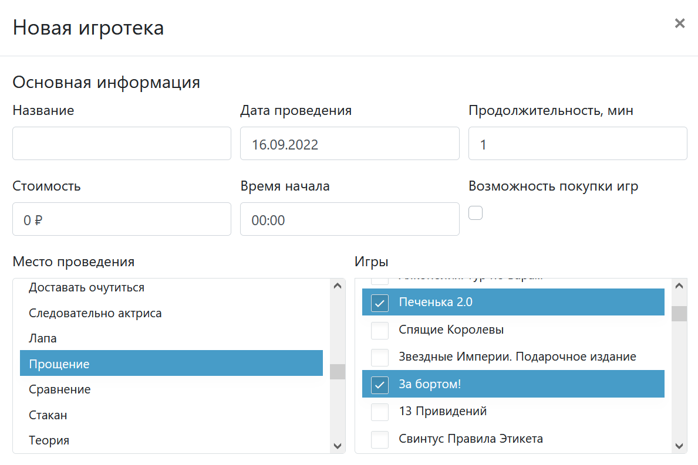
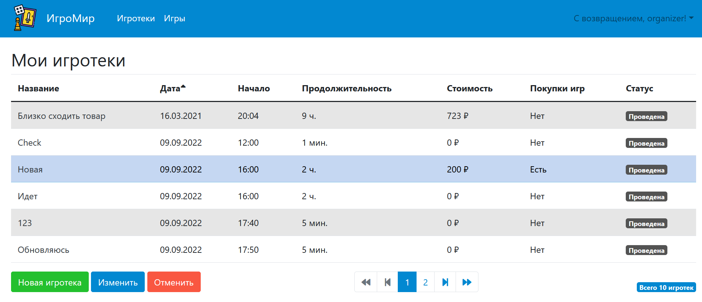

# Курсовая работа по "Базам данных"



**Тема:** создание информационной системы настольных игр и игротек

**Студент:** Маслова Марина Дмитриевна

**Научный руководитель:** Кузнецова Ольга Владимировна

**Расчетно-пояснительная записка:** [РПЗ](./docs/pdf/report.pdf)

**Презентация:** [Презентация](./docs/doc/presentation/presentation.pdf)


## Примеры работы программы

### Страница игротеки



### Страница настольной игры



### Формы регистрации и входа

<p align="center">
    
    
</p>

### Регистрация на игротеку



### Форма регистрации организатора



### Форма регистрации игротеки



### Игротеки организатора



```
Курсовая работа по курсу "Базы данных"
МГТУ им. Баумана
MyMiDiII
2022 г.
```

